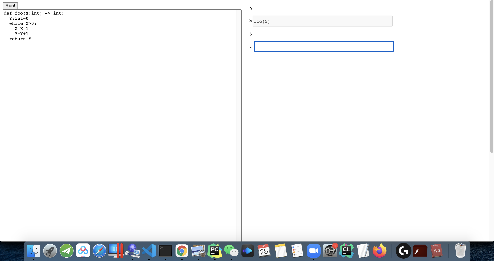
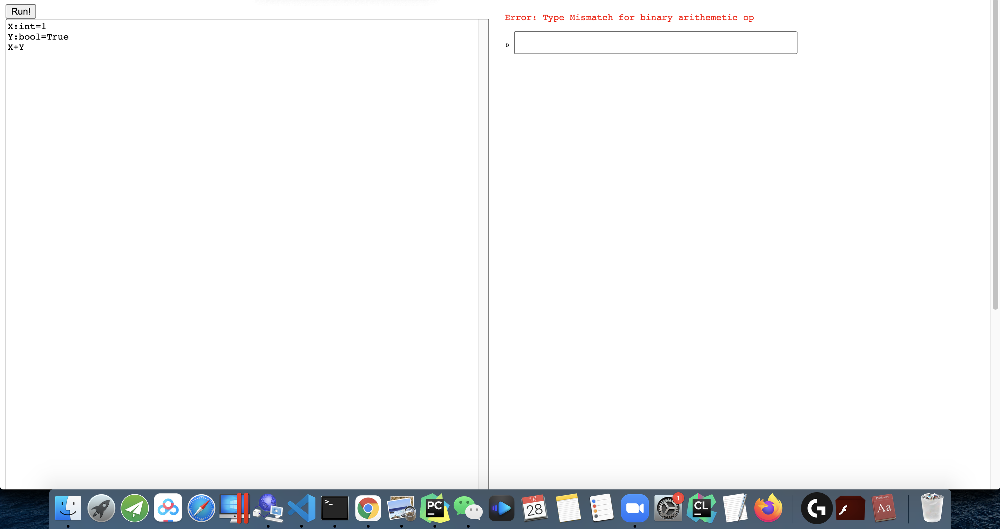
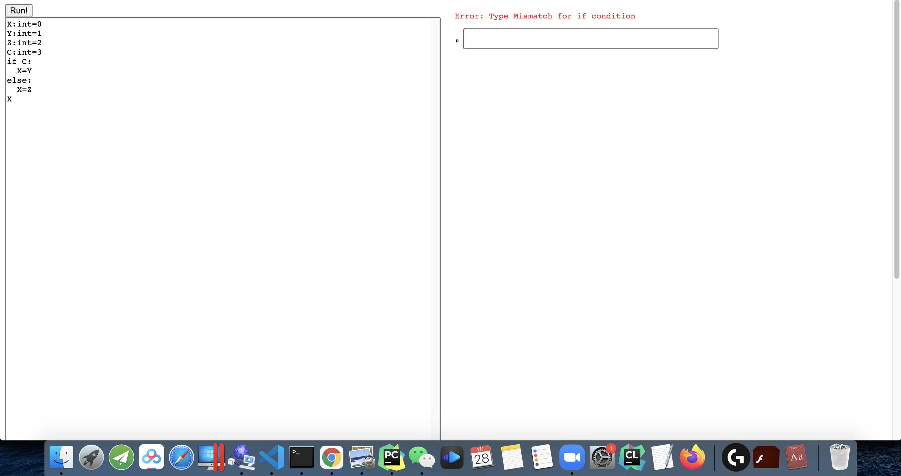
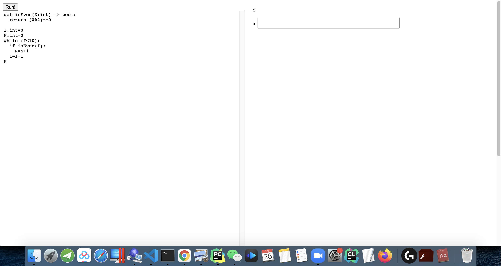
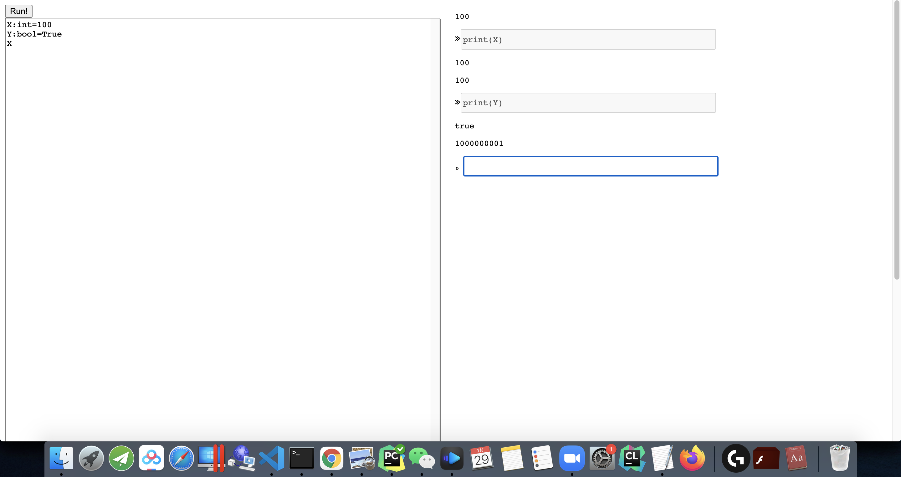
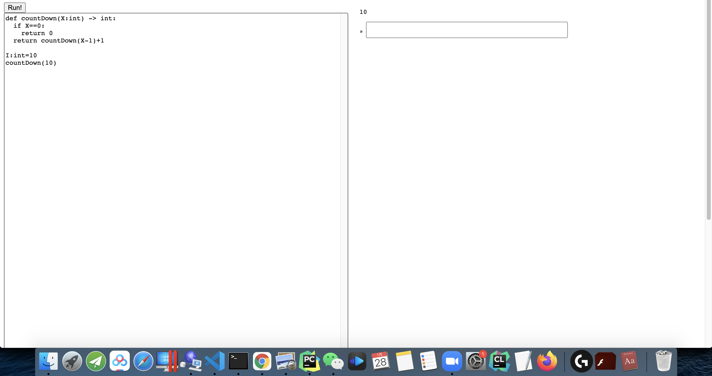
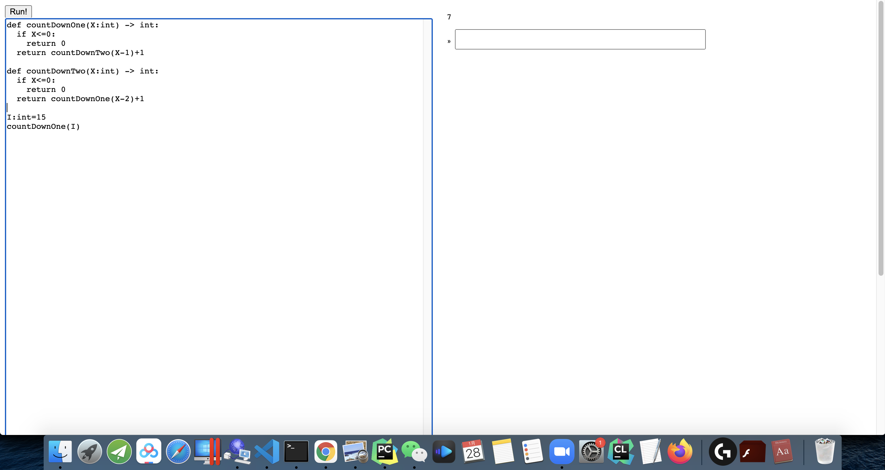

# CS231 FA20 PA1 Writeup
## Yiran Wu, A59004775

## Q1: Representation of values
I use two slightly different representations for values in TypeScript and WebAssembly.

In TypeScript, all three types are represented by a string denoting its type ('int', 'bool' or 'none') and a TS number type storing its value (integer for int, 0/1 for bool, and undefined for none).

I adopted a static-type design, so that types only live in TS for typechecking. For WASM everything is just i32, representing its value.

For example "X:int=100" is {type:"int", value:100} in TS, and "(i32.const 100)" in WASM.

"X:bool=True" is {type:"bool", value:1} in TS, and "(i32.const 1)" in WASM.

"X:none=None" is {type:"none"} in TS, and since none is purely for typechecking, we don't need to worry about it in WASM.


## Q2: Data Structures
I use a class called Scope to store information about the variables and functions in the current scope. Given the name of variable, we are able to find its type and address in WASM memory(to support REPL). Given the name of function, we can find its signature and WASM code implementation(to support REPL).
```
type  VarEntry = {

type:string,

address: number

}

  
type  FuncEntry = {

type:string,

argList:string[],

source: string[]

}


export  class  Scope {

vars: Map <string, VarEntry>;

funcs: Map <string, FuncEntry>;

name:string;

memoryCounter: number

super: Scope;

constructor(superEnv: Scope, name:string)

mergeInto(env: Scope)

getVar(name:string) : VarEntry 

getFunc(name:string) : FuncEntry

close()

}
```
### Global Variables
```
X:int=1
```
corresponds to a Scope with variable map
```
scope.vars= ('X', [type: "int", address: 0])
```
### Functions
```
def foo(X:int, Y:int) -> bool {
  body
}
```
corresponds to a Scope with function map
```
scope.funcs = ('foo', [type: "bool", argList:["int","int"], source: wasmCodeOfArgAndBody])
```
### Local variables in function
```
def foo(X:int, Y:int) -> bool {
  Z:int=0
  body
}
```
corresponds to a hierarchy of scopes:
```
outerScope.funcs = ('foo', [type: "bool", argList:["int","int"], source: wasmCodeOfArgAndBody])
innerScope.vars = ('Z', [type: "int", address: 2])
innerScope.super = outerScope
```
## Q3: Infinite loops
Consider this program
```
X:bool=True
Y:bool=True
while X:
  Y=True
```
Running this program on the webpage will cause the page to idle and then probably crash.

## Q4: Various scenarios

## 4.1 Function defined in main, called in REPL
```
def foo(X:int) -> int:
  Y:int=0
  while X>0:
    X=X-1
    Y=Y+1
  return Y

----REPL----
foo(5)
```



## 4.2 REPL calling main, REPL calling REPL
```
def foo(X:int) -> int:
  Y:int=0
  while X>0:
    X=X-1
    Y=Y+1
  return Y

----REPL----
def bar(X:int) -> int:    return (foo(X)//2)
```


## 4.3 TypeError for arithmetic op
```
X:int=1
Y:bool=True
X+Y
```




## 4.4 TypeError for if condition
```
X:int=0
Y:int=1
Z:int=2
C:int=3
if C:
  X=Y
else:
  X=Z
X
```




## 4.5 Calling in a loop
```
def isEven(X:int) -> bool:
  return (X%2)==0

I:int=0
N:int=0
while (I<10):
  if isEven(I):
    N=N+1
  I=I+1
N
```




## 4.6 Printing
My current implementation will not be able to print "True" or "False" for booleans. I can only print 0/1.

The reason is that, since I store type only in TypeScript, when I call print from WASM side, I have no idea about the type of the variable.

There's many workaround for this, e.g. also storing type information in WASM.




## 4.7 Recursive Function
```
def countDown(X:int) -> int:
  if X==0:
    return 0
  return countDown(X-1)+1

I:int=10
countDown(10)
```




## 4.8 Mutual calling
```
def countDownOne(X:int) -> int:
  if X<=0:
    return 0
  return countDownTwo(X-1)+1

def countDownTwo(X:int) -> int:
  if X<=0:
    return 0
  return countDownOne(X-2)+1

I:int=15
countDownOne(I)
```

